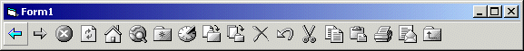



## Windows Explorer Icons \(20 x 20,  Hot and Cold\)

### Description

This submission contains 29 Icons ripped from Windows Explorer and Internet Explorer. There are a total of 29 separate icons, in both hot and cold form. A sample app shows the icons in use on a standard toolbar. This is not really code, but could be useful for web browser apps. This includes all the standard icons and all the optional ones. An EXE is included to check it out quickly.
 
### More Info
 

             |
---                |---
**Submitted On**   |2001-01-11 10:10:36
**By**             |[Kevino](https://github.com/Planet-Source-Code/PSCIndex/blob/master/ByAuthor/kevino.md)
**Level**          |Beginner
**User Rating**    |4.0 (8 globes from 2 users)
**Compatibility**  |VB 5\.0, VB 6\.0
**Category**       |[Graphics](https://github.com/Planet-Source-Code/PSCIndex/blob/master/ByCategory/graphics__1-46.md)
**World**          |[Visual Basic](https://github.com/Planet-Source-Code/PSCIndex/blob/master/ByWorld/visual-basic.md)
**Archive File**   |[CODE\_UPLOAD136691112001\.zip](https://github.com/Planet-Source-Code/kevino-windows-explorer-icons-20-x-20-hot-and-cold__1-14336/archive/master.zip)

